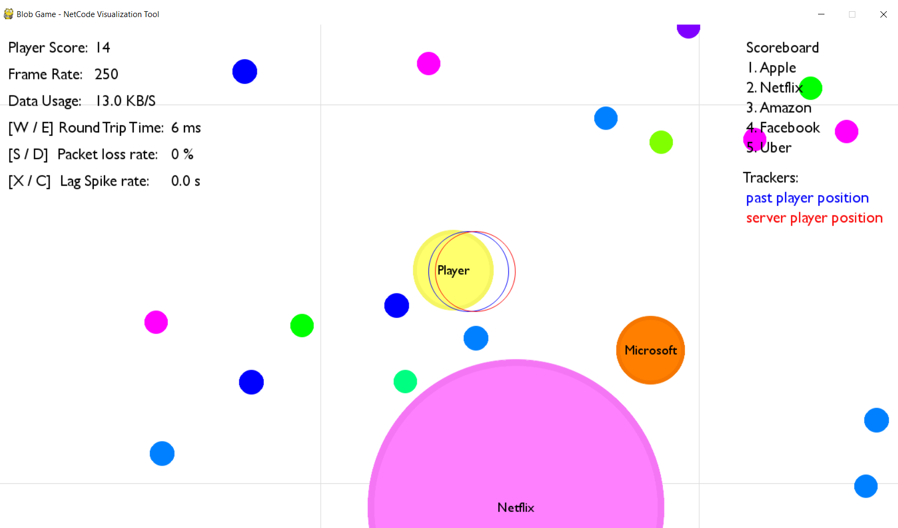

# Net-Blob

This project aims to provide insight into the networking of online multiplayer games, or "netcode" as it is broadly termed. An authoritative server-client model is used to enable gameplay resembling that of the online game [Agar.io](https://agar.io), which is accompanied by controls that allow the user to simulate poor network conditions. As the subject of this project would suggest, the client employs a number of commonly used techniques for reducing the negative impact of such poor conditions. These techniques are discussed in the about section below.

### Prerequisites

* Python 3.x
* Pygame

### How to run

[Install pygame](https://www.pygame.org/wiki/GettingStarted)

A local server may be started by running launch_server.py. This file specifies the size of the map, the orb density, and the number of player bots running on the server.
```
python launch_server.py
```
Once the server is running, or one wishes to connect to a public server, the client is started by running netblob.py.
```
python netblob.py
```

### How to play
##### Client
The default IP address provided in the client menu will be that of a local server. If connecting to a public one, the server's IP address will need to be provided at this stage. Once the player's name is entered, the "Play Game" button will attempt to connect the player to the server.


The client receives input from the player by mouse, as well as the keys  W/E, S/D, X/C, and the keys 1/2/3. 
* *Mouse position* - controls the characters movement.
* *Mouse left-click* - toggles the past player tracker.
* *Mouse right-click* - toggles the server player tracker.
* *W/E keys* - adjust the simulated round-trip-time (ping).
* *S/D keys* - adjust the simulated package loss rate.
* *X/C keys* - adjust the simulated "lag spike" duration.
* *1/2/3 keys* - adjust the window display size.

The scoreboard is displayed in the top-right corner, while the player's score, game frame rate, and connection statistics are displayed in the top-left corner.



##### Server
On the server side, the scoreboard is again displayed in the top-right corner, while the number of players, server frame rate, and server data usage are displayed in the top-left corner. The players' views may be cycled through by mouse left- and right-clicking. The server provides the option of generating autonomous bots that interact with real players, which are seen in the below image.


### About

This project aims to provide insight into the networking of online multiplayer games, or "netcode" as it is broadly termed. An authoritative server-client model is used to enable gameplay resembling that of the online game [Agar.io](https://agar.io), which is accompanied by controls that allow the user to simulate poor network conditions.

The client employes a number of techniques to reduce the impact of poor network conditions. One such technique is termed "movement prediction". In order to provide players with responsive movement of their character under poor conditions, each client simulates player movement locally, and then retroactively corrects for discrepancies with the authoritative server game state in order to prevent decoherence over time. This process is visualized by the in-game "Trackers", which display the player's last received position from the server, along with the player's local position in the past. The past position is chosen to correspond to the time difference between the server state and the local state i.e. the server-client rount-trip-time. In other words, the past position corresponds to the player's local position from exactly one round-trip-time ago. The difference in position of the two trackers is used to perform the corrections needed to prevent decoherence in real time.

Another important factor is the load impacted on the client's connection by the frequent server updates. Clients may have limited connection speeds, and so it is important that updates be concisely communicated, while still preserving the integrity of the gameplay. To this end, player positions are communicated to clients on a best-effort-basis at high frequency, while updates relating to orbs are communicated more conservatively with each update being acknowledged. It is also important to allow for updates to be received and processed out of order to minimize the impact of what's known as "packet loss". Updates are thus communicated by User Datagram Protocol (UDP) sockets, to avoid the restrictions on packet order set by Transmission Control Protocol (TCP) sockets.

The above provides only a narrow view of the full scope of networking issues addressed. For a broad summary of conventional networking  problems and techniques used for online games see [this article](https://medium.com/@meseta/netcode-concepts-part-1-introduction-ec5763fe458c) or [this video](https://www.youtube.com/watch?v=vTH2ZPgYujQ). For implementation details of many of these techniques see the python files for the server + client code.

Lastly, in order to support large numbers of clients playing simultaneously in the same environment, it is important that the server-side game logic scale appropriately with player count and map size. On the client side, emphasis must be put on rendering the visuals of the game efficiently in order to support the high refresh rate needed for a smooth playing experience. This is explored in the file labeled [analysis.md](analysis.md).


## License

This project is licensed under the MIT License - see the [LICENSE](LICENSE) file for details.
