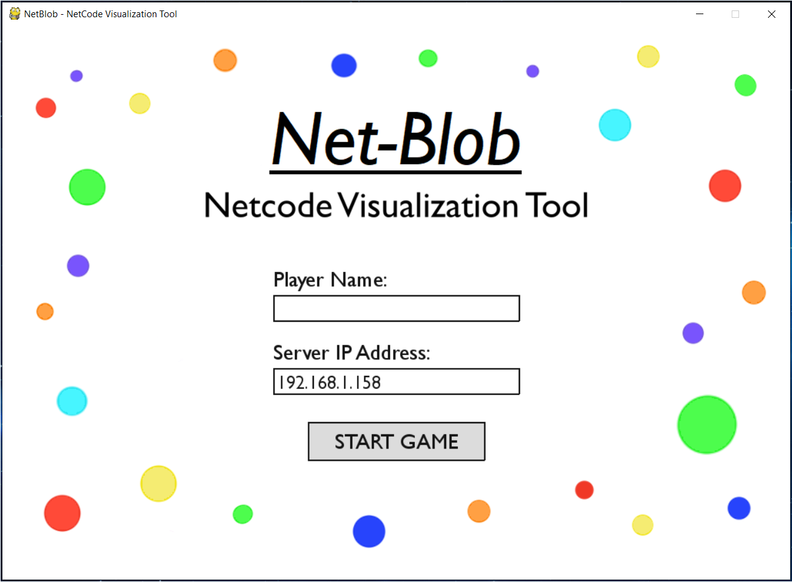
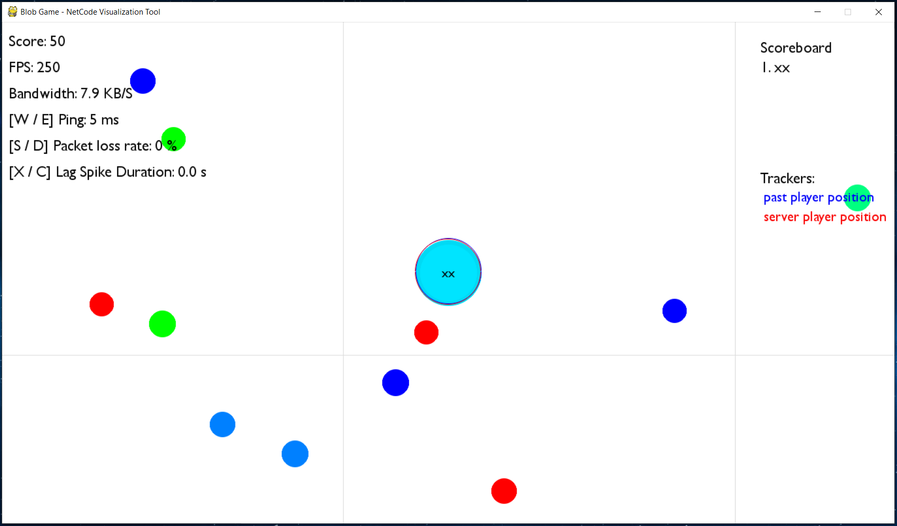

# Net-Blob

This project aims to provide insight into the networking of online multiplayer games, or "netcode" as it is broadly termed. A server-authoritative server-client model is used to present gameplay resembling that of the online game [Agar.io](https://agar.io), which is accompanied by controls that allow the user to simulate poor network conditions. As the subject of this project would indicate, the client employs commonly used techniques for reducing the negative impact of such poor conditions. 

### About 

One technique employed is termed "movement prediction", where each client simulates player movement locally, and then retroactively corrects for discrepancies with the authoritative server game state in order to prevent decoherence over time. This process is visualized by the in-game "Trackers", which display the player's last received position from the server, along with the player's local position in the past which corresponds with the time difference between the server state and the local state. This time difference is known as the round-trip-time (also known as "ping" or "latency").

Another important factor is the load impacted on the client's connection by the frequent server updates. Client's may have limited connection speeds, and so it is important that updates be concisely communicated to clients, while still preserving the integrity of the gameplay. It is also important to allow for updates to be received and processed out of order to minimize the impact of what's known as "packet loss". To this end, player positions are communicated to clients on a best-effort-basis at high frequency, while updates relating to orbs are communicated more conservatively using a system of acknowledgement. Updates are communicated by User Datagram Protocol (UDP sockets), to avoid the restrictions set by Transmission Control Protocol.

Lastly, in order to support large numbers of clients playing simultaneously in the same environment, it is important that the server-side game logic scale appropriately with player count and map size. On the client side, emphasis must be put on rendering the visuals of the game efficiently in order to support the high refresh rate needed for a smooth playing experience. This is explored in the file labeled [analysis.md](analysis.md).

### Prerequisites

* Python 3.x
* Pygame

### How to run

 First - install pygame. This can be done through pip.
 ```
pip install pygame
```
A local server may be started by running the launch_server.py file. This file specifies the size of the map, the orb density, and the number of player bots running on the server.
```
python launch_server.py
```
Once the server is running, or one wishes to connect to a public server, the client is started by running the netblob.py file.
```
python netblob.py
```
The default IP address provided in the client menu will be that of a local server. If connecting to a public one, the IP address will need to be provided at this stage. Once the player's name is entered, the "Play Game" button will attempt to connect the player to the game running on the server.

### How to play

  In the main menu, the user can mannualy input a player name and server IP (local or public).

In the server view, the user can see information about number of active players, frames per second of the server view, and the total server bandwidth being used.

In the client side, the user can play with **mouse movement, mouse left/right clicks, W/E, S/D, X/C keys** on the keyboard. 
* Mouse movement controls the direction of the user's orbit.
* Mouse left click shows the past player position, which tracks the players local position back in time (substract the pingh from the local time to estimate server time).
* Mouse right click shows the server player position, which tracks the position of the player according to the last game state received from the server in real time.
* W/E keys changes the ping.
* S/D keys changes the package loss rate.
* X/C keys changes the lag spike duration.







## License

This project is licensed under the MIT License - see the [LICENSE](LICENSE) file for details.
