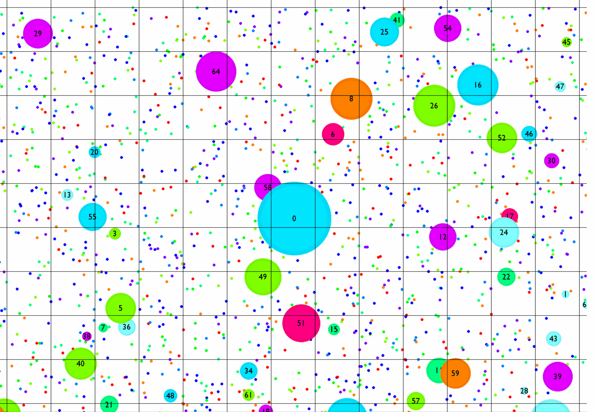
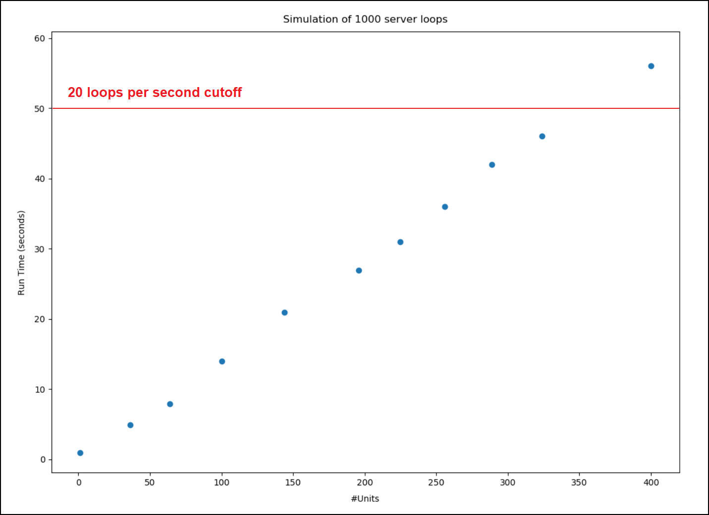

# Netblob - Performance Report

In this document, the performance of the client and the server are analysed. The main challenges faced in each case are discussed, along with proposed solutions to those challenges.

### Client
On the client side, emphasis is put on rendering the visuals of the game efficiently in order to support the high frame rate needed for a smooth playing experience. On a modern system, the frame rate stays above 200 frames/s for the most part, which is good considering the inherently slow nature of Pygame. The table below displays the execution time profile for the main game loop. Note that 92% of execution time is spent displaying the game.

| Client Execution Time Profile       |  Time |
|-------------------------------------|-------|
| Client Communication + Game Logic&emsp;&emsp;| 8 s|
| Clearing the Display                | 18 s  |
| Drawing the Orbs                    | 10 s  |
| Drawing the Players + Trackers      | 16 s  |
| Drawing the Scoreboard + Statistics | 13 s  |
| Applying the Updated Display        | 35 s  |
| **Total Execution Time**            | **100 s** |

An advantage of the server authoritative model is that it offloads most of the game logic onto the server, freeing the client to focus on rendering the display. Unfortunately, Pygame does not offer a great toolset for efficiently rendering the visuals, which done exclusively on the CPU. There do exist other less established third-party libraries that improve on this, and so it may be worth exploring alternatives to pygame in the future.

### Server

On the server side, the displaying of the game is not subject to analysis as it is not a critical function of the server. As for the game logic, in order to support large numbers of clients playing simultaneously in a shared environment, it is important that the logic scale appropriately with player count and map size. To that end, the server stores all players and orbs in a CellContainer, which splits the entire game map into the small cells displayed by the grid-pattern seen in game. This is apparent from the below figure, which cycles through the unfiltered entities, then the filtered entities within visual range of the player (those entities that are transmitted to the player), and lastly the filtered entities within collision-hazard range of the player which are checked for collision.

The advantage derived from splitting the game entities into this kind of a grid is that it allows for constant-time extraction of players' local environments under normal conditions. The figure below displays the execution runtime for 1000 game loops under different loads.

The load is measured in terms of units, where each unit corresponds to a single simulated player along with 50 orbs in a 2560x1440 area. The load is scaled up by joining several units together into one cohesive map of size ranging up to 20x20 units, which corresponds to 400 players simulated simultaneously in a shared environment containing 20.000 orbs. These simulations may be accessed in the test_server.py file.

The linear relationship between nr. of units and runtime suggests that there is no significant difference between hosting players in many small environments separately vs hosting players in one large shared environment, given that players and orbs do not aggregate into small sections of the map. This is a reasonable assumption given normal playing conditions. In the event that players do decide to aggregate for whatever reason, the n^2 behavior may be escaped by placing a limit on how many neighboring entities are processed and transmitted to each player. This sacrifice in fidelity is not a big price to pay considering that players would have a hard time processing information about say > 50 other nearby players on their screens either way.

Note that, given the fixed runtime to process the local environments of players, the map could be made arbitrarily large containing an arbitrary number of orbs without increasing the load on the server game logic, as long as the relative player and orb concentrations remain unchanged.

Lastly, the table below displays the execution time profile for the game loop. 

| Server Execution Time Profile       |  Time |
|-------------------------------------|-------|
| Processing Player movements &emsp;&emsp;&emsp;| 10 s|
| Processing Player collisions        | 8 s  |
| Processing Orb collisions           | 17 s  |
| Extracting local views              | 26 s  |
| Processing orb view updates         | 29 s  |
| Server Communication                | 10 s  |
| **Total Execution Time**            | **100 s** |

We see that most of the execution time is spent extracting and processing updates about the players' local views (that is, updates regarding the orbs and other players within visual range that must be displayed on each player's screen). The runtime of these functions is directly proportional to the number of entities within range of each player, and can not be significantly improved without moving to a faster programming language.

